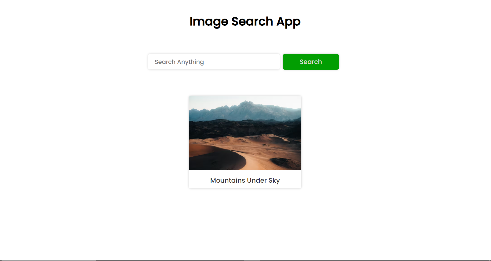
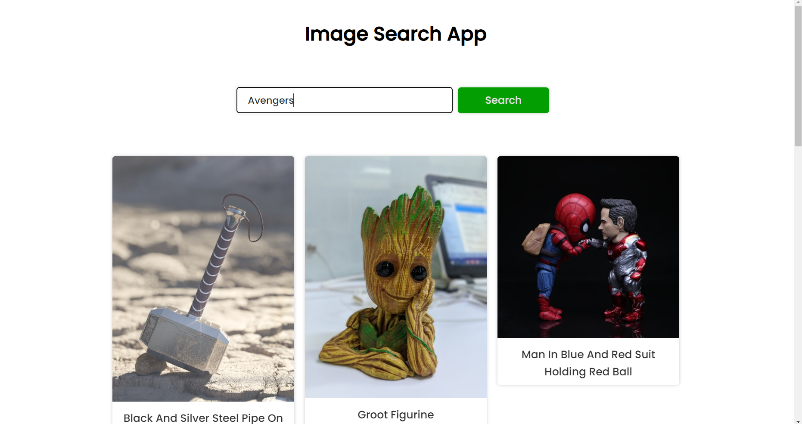
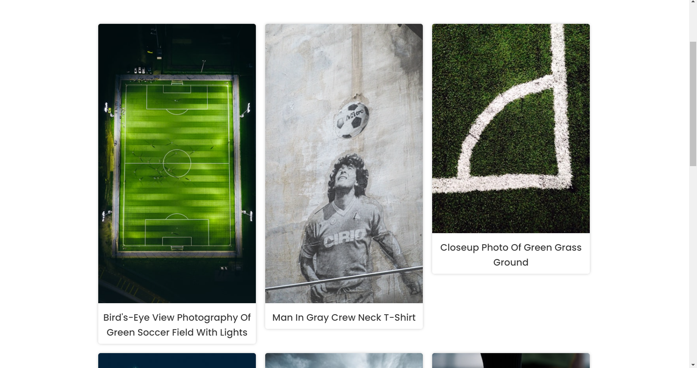

# Image Search App

This project is an image search web application that fetches images from the Unsplash API based on user input. It was built to enhance my knowledge of JavaScript, API integration, and asynchronous programming.

## Features

- Search for Images: Users can search for images by entering keywords.
- Load More Results: Users can load more results by clicking the "Show More" button.
- Responsive Design: Ensures the application looks great on all devices.
- Interactive UI: Displays search results dynamically without reloading the page.
  
Getting Excited ! Check it out --->  [Image Search App](https://aryannxroot.github.io/ImageSearchApp).

## Screenshots

### Homepage 


### Search Results


  
## Installation

To get started with the project, clone the repository and install the necessary dependencies:

```bash
git clone https://github.com/yourusername/ImageSearchApp.git
cd ImageSearchApp
```

## Usage 
Open the index.html with live server in vs code. 


## Technologies Used

- **HTML5**: For structuring the web content.
- **CSS3**: For styling components.
- **JavaScript (ES6+)**: Modern JavaScript features.
- **Unsplash API**: For fetching the images from unsplash.

## Contributing

Contributions are welcome! Please feel free to submit a Pull Request.

## Author

Aryan (@aryannxroot)

## License

This project is licensed under the MIT License. See the [MIT LICENSE](./LICENSE) file for more information.
